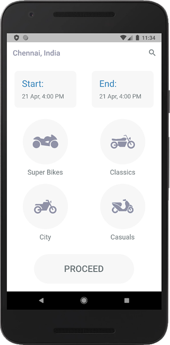
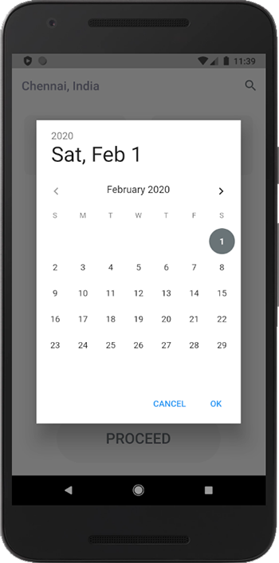
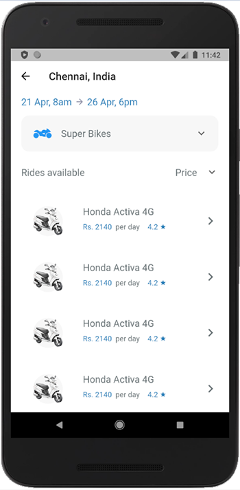
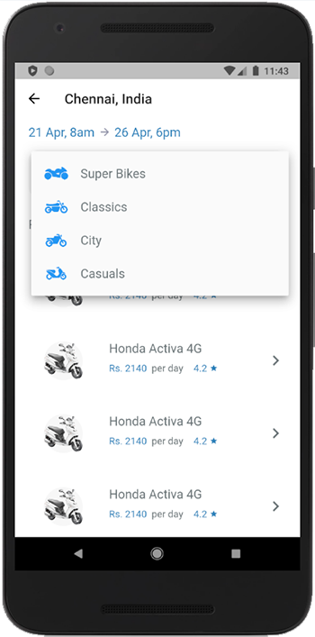
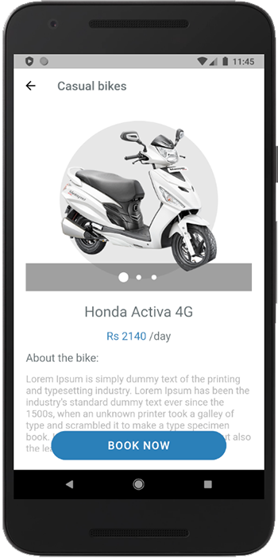
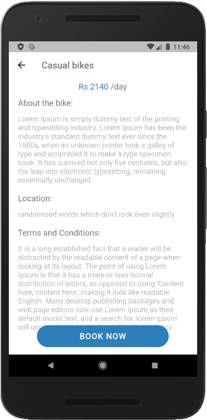

# Bike Rental App

A UI Project for a Bike rental Application developed in #Flutter

The Design for this app can be found at [Dribble link](https://dribbble.com/shots/4466238-Bike-Rental-App-Day-102-365-Project365) and [Project 365](https://project365.design/2018/04/12/day-102-bike-rental-app-white-space-challenge/)

### Home Page

       

### Search

       

### Bike Details

       